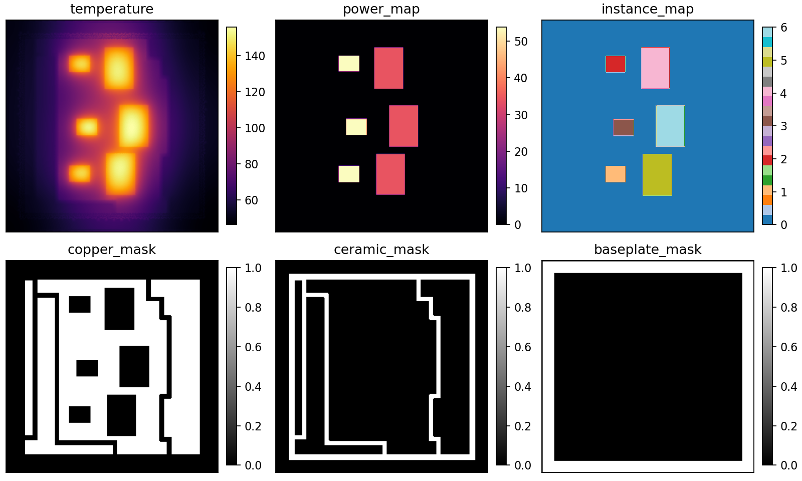

# Multi-topology Power Module Thermal Simulation Dataset

English | [中文](#中文说明)

This repository contains a multi-topology thermal simulation dataset for power modules. It was built for image-based and multi-modal surrogate modeling of steady-state temperature fields under varying chip layouts, copper partitions, chip power-loss settings, and convective cooling conditions.

The dataset accompanies the study **"A Multi-modal Surrogate Model for Multi-topology Thermal Estimation in Power Modules"** by Ruiting Ke, Jianfeng Tao, and Chengliang Liu.



## Highlights

- **20,350 HDF5 samples**, about **4.67 GB** in total.
- **Train/validation/test split** already provided as folders.
- **Seven topology-mask families** covering different chip counts, chip layouts, and copper partition patterns.
- Each sample stores aligned **256 x 256** maps for temperature, power density, chip instances, and material masks.
- Path names encode labels: split, topology, layout/mask id, IGBT power-loss setting, FWD power-loss setting, and convective heat-transfer coefficient.

## Repository Layout

```text
.
├── TrainData/
├── ValData/
├── TestData/
├── assets/
│   └── sample_preview.png
├── metadata/
│   ├── manifest.csv
│   └── summary.json
├── scripts/
│   ├── generate_manifest.py
│   └── inspect_sample.py
├── DATASET_CARD.md
├── CITATION.cff
├── LICENSE
└── README.md
```

Each HDF5 file follows this path pattern:

```text
{TrainData|ValData|TestData}/{topology}/{mask_id}_Pigbt{Pigbt}_Pfwd{Pfwd}_h{h}/data.h5
```

Example:

```text
TrainData/Mask_HB_V3-0/141_Pigbt450_Pfwd200_h6000/data.h5
```

Label meaning:

| Path field | Meaning |
| --- | --- |
| `TrainData`, `ValData`, `TestData` | Data split. |
| `Mask_*` | Topology/material-mask family. `HB` and `3P6P` follow the naming used in the source simulation workflow. |
| `mask_id` | Three-digit layout or mask identifier within a topology family. |
| `Pigbt` | Encoded IGBT chip power-loss setting. |
| `Pfwd` | Encoded freewheeling-diode chip power-loss setting. |
| `h` | Convective heat-transfer coefficient setting. The HDF5 attribute `h_normalized` equals `h / 10000`. |

The files present in the repository define the valid samples. Do not assume that every layout id has every possible operating-condition combination.

## Dataset Statistics

| Split | Samples | Size |
| --- | ---: | ---: |
| `TrainData` | 14,242 | 3.27 GB |
| `ValData` | 3,050 | 0.70 GB |
| `TestData` | 3,058 | 0.70 GB |
| **Total** | **20,350** | **4.67 GB** |

| Topology | Samples | Device instances per sample | Unique layout ids |
| --- | ---: | ---: | ---: |
| `Mask_3P6P_V1` | 3,695 | 4 | 77 |
| `Mask_3P6P_V2` | 2,784 | 4 | 58 |
| `Mask_HB_V1` | 960 | 2 | 20 |
| `Mask_HB_V2` | 2,976 | 4 | 62 |
| `Mask_HB_V3-0` | 4,896 | 6 | 102 |
| `Mask_HB_V3-1` | 3,215 | 4 | 67 |
| `Mask_HB_V3-2` | 1,824 | 2 | 38 |

## HDF5 Schema

Every `data.h5` file contains the same dataset keys:

| Key | Shape | Dtype | Description |
| --- | --- | --- | --- |
| `temperature` | `(256, 256)` | `float32` | Steady-state top-surface temperature field, in degrees Celsius. |
| `power_map` | `(256, 256)` | `float32` | Spatial power-density map aligned with chip regions. |
| `instance_map` | `(256, 256)` | `uint16` | Chip instance labels. `0` is background; positive ids identify chips. |
| `ceramic_mask` | `(256, 256)` | `uint8` | Binary ceramic-region mask. |
| `baseplate_mask` | `(256, 256)` | `uint8` | Binary baseplate/substrate-region mask. |
| `copper_mask` | `(256, 256)` | `uint8` | Binary copper-region mask. |
| `h_normalized` | `(1,)` | `float32` | Normalized cooling coefficient, equal to `h / 10000`. |
| `max_temps` | `(N,)` | `float32` | Maximum temperature of each chip instance. |
| `row_ids` | `(N,)` | `uint16` | Chip instance ids corresponding to `max_temps`. |

HDF5 attributes stored in each file:

| Attribute | Description |
| --- | --- |
| `description` | Short source description. |
| `h_value` | Original `h` value parsed from the sample condition. |
| `h_normalized` | Normalized `h`. |
| `mask_id` | Three-digit layout/mask id. |
| `sample_name` | Folder-level sample name. |
| `version` | Topology family name. |

`N` is the number of chip instances in that topology family. It is 2, 4, or 6 in this dataset.

## Quick Start

The dataset is about 4.67 GB. For a lighter first download, a shallow clone is recommended:

```bash
git clone --depth 1 https://github.com/henkuailederen/Multi-topology-Dataset.git
cd Multi-topology-Dataset
pip install -r requirements.txt
```

Read one sample:

```python
from pathlib import Path
import h5py

sample = Path("TrainData/Mask_HB_V3-0/141_Pigbt450_Pfwd200_h6000/data.h5")

with h5py.File(sample, "r") as f:
    temperature = f["temperature"][:]
    power_map = f["power_map"][:]
    chip_instances = f["instance_map"][:]
    chip_mask = chip_instances > 0
    max_temps = f["max_temps"][:]
    row_ids = f["row_ids"][:]
    h_normalized = f["h_normalized"][0]

    print(temperature.shape, temperature.dtype)
    print(dict(f.attrs))
```

Or inspect a file from the command line:

```bash
python scripts/inspect_sample.py TrainData/Mask_HB_V3-0/141_Pigbt450_Pfwd200_h6000/data.h5 --plot sample.png
```

## Dataset Construction

The samples were generated through an automated pipeline for power-module thermal analysis:

1. Parametric CAD models were generated with CADQuery.
2. Geometric validity checks removed invalid layouts such as chip overlaps or boundary violations.
3. STEP models were imported into a COMSOL Multiphysics + MATLAB batch workflow.
4. Materials, heat sources, meshes, and convection boundary conditions were assigned automatically.
5. Steady-state FEM simulations produced top-surface temperature fields and per-chip maximum temperatures.
6. Geometry masks, power maps, cooling conditions, and FEM outputs were merged into per-sample HDF5 files.

The data are intended for supervised surrogate modeling, image-to-field regression, multi-modal learning, topology-aware thermal estimation, and benchmark studies for power-module design.

## Metadata

`metadata/manifest.csv` lists every sample with parsed labels:

- `split`
- `topology`
- `mask_id`
- `Pigbt`
- `Pfwd`
- `h_value`
- `h_normalized`
- `n_instances`
- `bytes`
- `path`

`metadata/summary.json` stores aggregate counts by split, topology, and operating-condition label.

Regenerate metadata after changing files:

```bash
python scripts/generate_manifest.py
```

## Citation

If you use this dataset, please cite the accompanying paper and this repository. A machine-readable citation file is provided in `CITATION.cff`.

## License

The dataset is released under the **Creative Commons Attribution 4.0 International (CC BY 4.0)** license. Please attribute the dataset and paper when redistributing or using the data.

---

## 中文说明

本仓库包含一个用于功率模块稳态热场估计的多拓扑热仿真数据集。数据集面向基于图像表示和多模态输入的热代理模型，可用于不同芯片布局、铜层分区、芯片功耗工况和对流换热条件下的温度场预测。

该数据集对应论文 **"A Multi-modal Surrogate Model for Multi-topology Thermal Estimation in Power Modules"**，作者为 Ruiting Ke、Jianfeng Tao 和 Chengliang Liu。

## 数据集特点

- 共 **20,350 个 HDF5 样本**，总大小约 **4.67 GB**。
- 已划分为训练集、验证集和测试集。
- 包含 **7 类拓扑/材料掩膜族**，覆盖不同芯片数量、芯片布局和铜层分区形式。
- 每个样本包含对齐的 **256 x 256** 温度场、功率密度图、芯片实例图和材料掩膜。
- 文件路径直接编码标签：数据划分、拓扑类别、版图/掩膜编号、IGBT 功耗设置、续流二极管功耗设置和对流换热系数。

## 路径标签规则

每个 HDF5 文件遵循如下路径：

```text
{TrainData|ValData|TestData}/{topology}/{mask_id}_Pigbt{Pigbt}_Pfwd{Pfwd}_h{h}/data.h5
```

示例：

```text
TrainData/Mask_HB_V3-0/141_Pigbt450_Pfwd200_h6000/data.h5
```

字段含义：

| 字段 | 含义 |
| --- | --- |
| `TrainData`, `ValData`, `TestData` | 数据集划分。 |
| `Mask_*` | 拓扑/材料掩膜族。`HB` 与 `3P6P` 沿用原仿真流程中的命名。 |
| `mask_id` | 该拓扑族内的三位版图/掩膜编号。 |
| `Pigbt` | IGBT 芯片功耗设置。 |
| `Pfwd` | 续流二极管芯片功耗设置。 |
| `h` | 对流换热系数设置。HDF5 中的 `h_normalized` 等于 `h / 10000`。 |

请以仓库中实际存在的文件为准。不要默认每一个版图编号都包含所有可能的工况组合。

## HDF5 内容

所有 `data.h5` 文件包含相同的数据键：

| 键 | 形状 | 类型 | 说明 |
| --- | --- | --- | --- |
| `temperature` | `(256, 256)` | `float32` | 稳态顶表面温度场，单位为摄氏度。 |
| `power_map` | `(256, 256)` | `float32` | 与芯片区域对齐的空间功率密度图。 |
| `instance_map` | `(256, 256)` | `uint16` | 芯片实例标签。`0` 为背景，正整数为芯片编号。 |
| `ceramic_mask` | `(256, 256)` | `uint8` | 陶瓷区域二值掩膜。 |
| `baseplate_mask` | `(256, 256)` | `uint8` | 基板/底板区域二值掩膜。 |
| `copper_mask` | `(256, 256)` | `uint8` | 铜层区域二值掩膜。 |
| `h_normalized` | `(1,)` | `float32` | 归一化换热系数，即 `h / 10000`。 |
| `max_temps` | `(N,)` | `float32` | 每个芯片实例的最高温度。 |
| `row_ids` | `(N,)` | `uint16` | 与 `max_temps` 一一对应的芯片实例编号。 |

其中 `N` 为该拓扑下的芯片实例数量，本数据集中为 2、4 或 6。

## 快速读取

数据集约 4.67 GB。为了减少首次下载体积，建议使用浅克隆：

```bash
git clone --depth 1 https://github.com/henkuailederen/Multi-topology-Dataset.git
cd Multi-topology-Dataset
pip install -r requirements.txt
```

读取一个样本：

```python
from pathlib import Path
import h5py

sample = Path("TrainData/Mask_HB_V3-0/141_Pigbt450_Pfwd200_h6000/data.h5")

with h5py.File(sample, "r") as f:
    temperature = f["temperature"][:]
    power_map = f["power_map"][:]
    instance_map = f["instance_map"][:]
    chip_mask = instance_map > 0
    max_temps = f["max_temps"][:]
    row_ids = f["row_ids"][:]

    print(temperature.shape, temperature.dtype)
    print(dict(f.attrs))
```

## 引用

如果使用本数据集，请引用对应论文和本仓库。仓库中提供了 `CITATION.cff` 机器可读引用文件。

## 许可证

本数据集采用 **Creative Commons Attribution 4.0 International (CC BY 4.0)** 协议开放。使用、分发或再发布时请注明数据集和论文来源。
